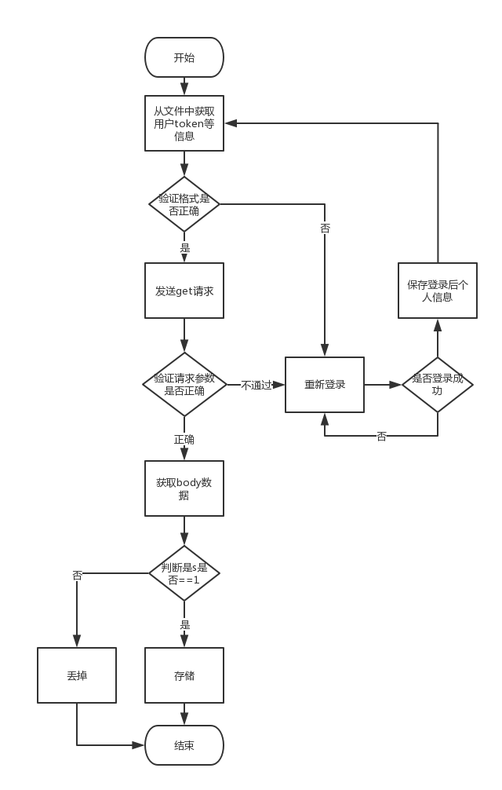

# juejin-spider
本菜虫使用nodejs技术，利用Promise控制同步，比较蛋疼哈，异步的语言硬生生搞成同步。

1. 开发环境
* node v10.4.0
* ubuntu 18.04 LTS
* mysql 5.7.22-0ubuntu18.04.1
* redis-server v4.0.9

2. 准备工作和运行
* npm install

3. 配置工作
* 数据库配置
```javascript
// database/config.js 
// example
module.exports = {
  host: '127.0.0.1',
  user: 'root',
  password: '123456',
  database: 'test',
  insecureAuth: true
}
```
* 用户掘金账户信息
```javascript
// auth/config.js
// example
module.exports = {
  email: 'xxx@163.com',
  password: 'xxx'
}
```

4. 启动
* 开发调试
```
node index.js
```

* 生产环境
```
pm2 start index.js
```

3. 代码流程



### change log ###
**2018-8-6 10:13:57**

现状：
    实现正常爬取和存储，使用到布隆过滤器，但是实际效果出现重复据。
权限验证一块，一直未出现token过期的问题，未作处理

计划：
    解决重复爬取问题

**2018-8-13 13:59:45**

去掉布隆过滤器，暂时将objectId作为key存储到redis中，后期考虑定时清理和惰性清理redis

**2018-8-14 11:21:41**

简单的错误处理＆日志输出功能
目前为止，代码给人的整体感觉还是dog shit.

**2018-11-14 22:11:37**

文件重命名，根据功能划分模块

参考文章

https://cnodejs.org/topic/5ad2c1a4ba60fcc66b7b80fe
